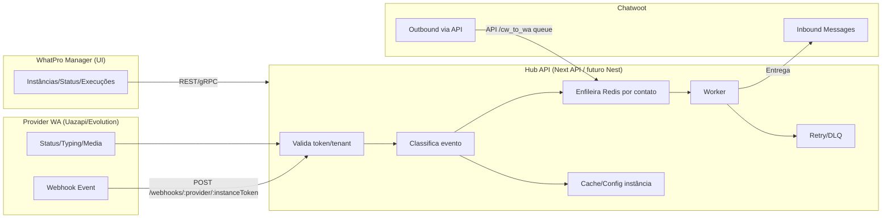

# Flowchart — Fluxo Alto Nível

Notas:
- Filas em Redis isoladas por tenant+inbox+contato; locks para ordem.
- Retry limitado + DLQ com visibilidade e limpeza de fila.
- Tokens de instância só no Hub; Manager nunca recebe.
